# 📊 Diagramas do Sistema - Assistente Financeiro

Este documento contém diagramas visuais da arquitetura usando Mermaid.

## 🏗️ Diagrama de Arquitetura Geral

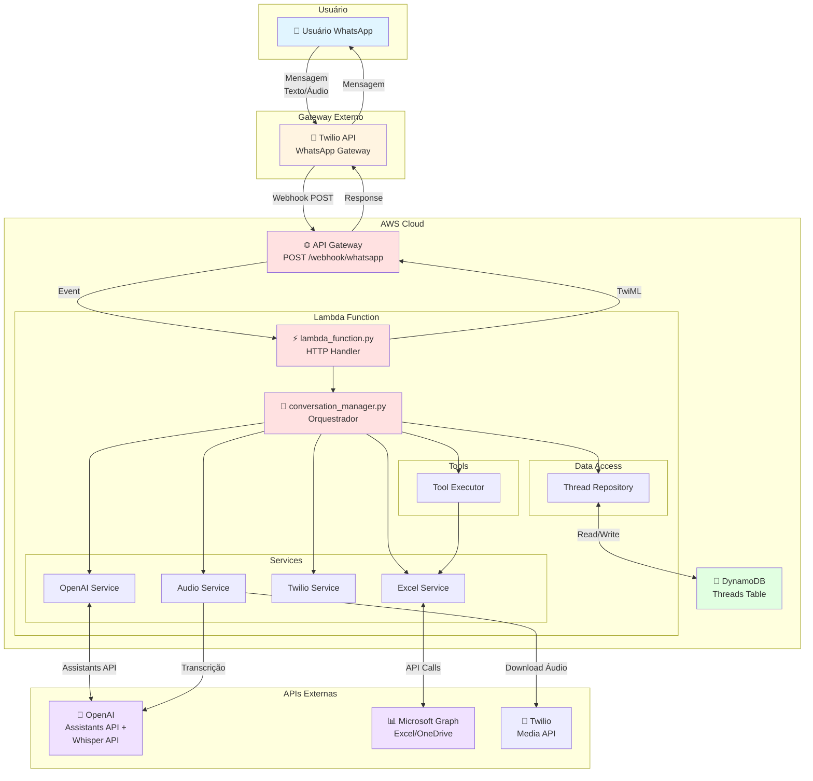

---

## 🔄 Fluxo de Processamento de Mensagem

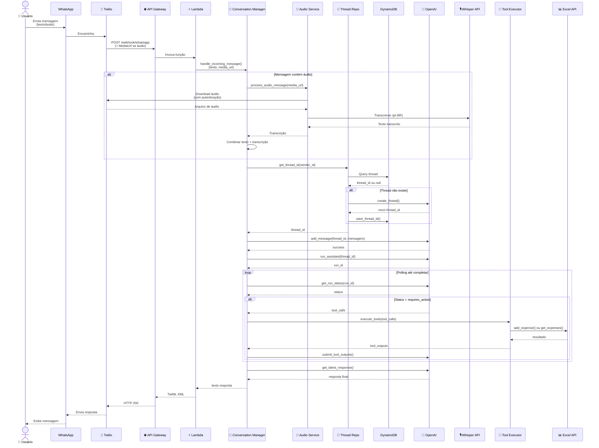

---

## 🛠️ Fluxo de Execução de Tool (Adicionar Despesa)

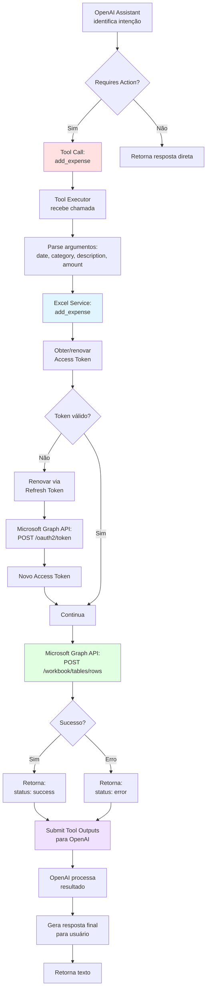

---

## 🎤 Fluxo de Processamento de Áudio (Whisper)

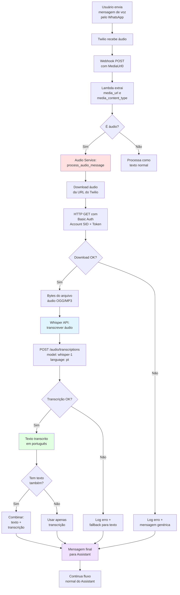

**Formatos de Áudio Suportados:**
- OGG (padrão WhatsApp)
- MP3, MP4, MPEG
- M4A, WAV, WEBM

**Limite:** 25 MB por arquivo

---

## 📁 Arquitetura de Módulos

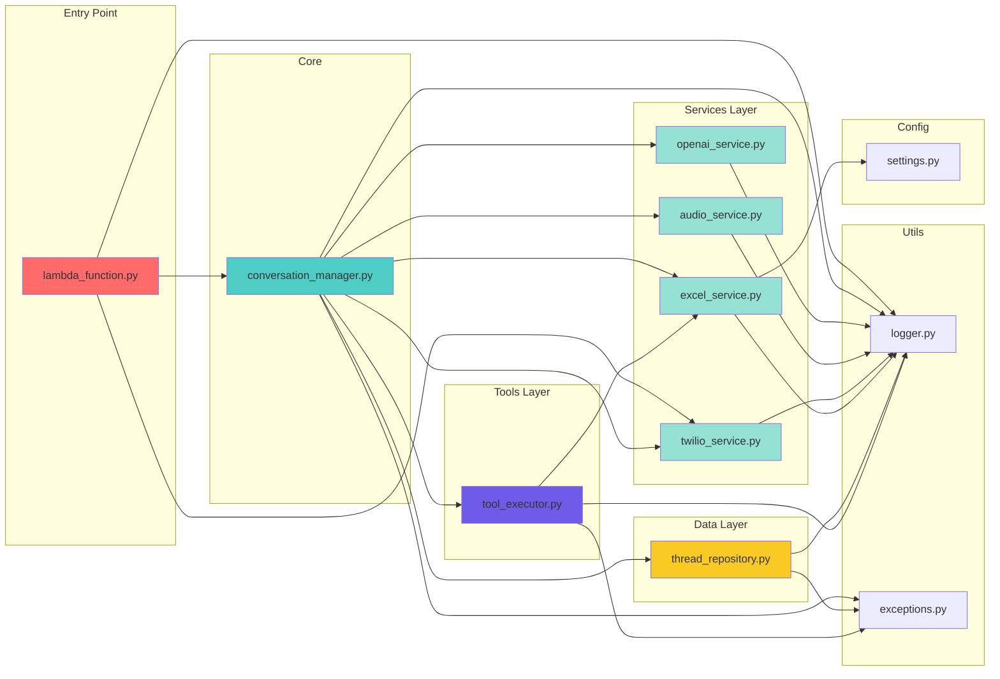

---

## 🗄️ Modelo de Dados DynamoDB

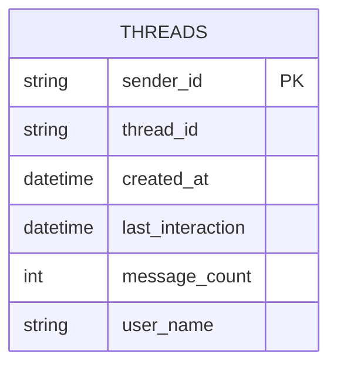

**Descrição:**
- `sender_id`: Número WhatsApp (formato: `whatsapp:+5511999999999`)
- `thread_id`: ID da thread do OpenAI (formato: `thread_abc123xyz`)
- `created_at`: Timestamp de criação da thread
- `last_interaction`: Timestamp da última mensagem
- `message_count`: Contador de mensagens trocadas
- `user_name`: Nome do usuário (opcional)

---

## 📊 Estrutura da Planilha Excel

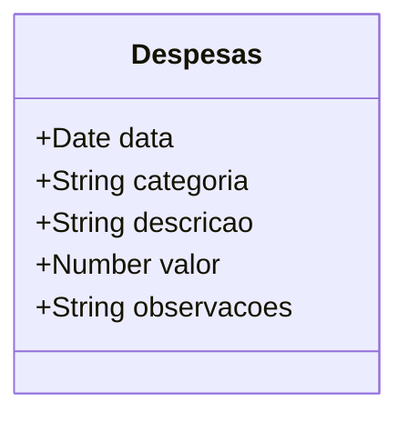

**Exemplo de Dados:**

| Data | Categoria | Descrição | Valor | Observações |
|------|-----------|-----------|-------|-------------|
| 2025-10-21 | Alimentação | Almoço | 45.00 | Restaurante X |
| 2025-10-20 | Transporte | Uber | 25.50 | Casa → Trabalho |
| 2025-10-19 | Saúde | Farmácia | 68.90 | Medicamentos |

---

## 🔐 Fluxo de Autenticação Microsoft Graph

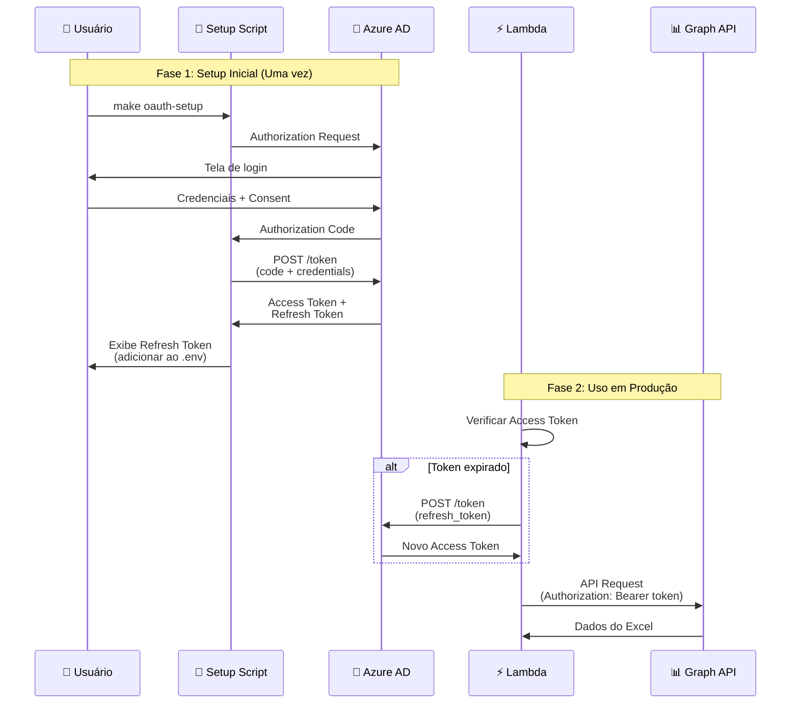

---

## ⚙️ Ciclo de Vida do Assistant Run

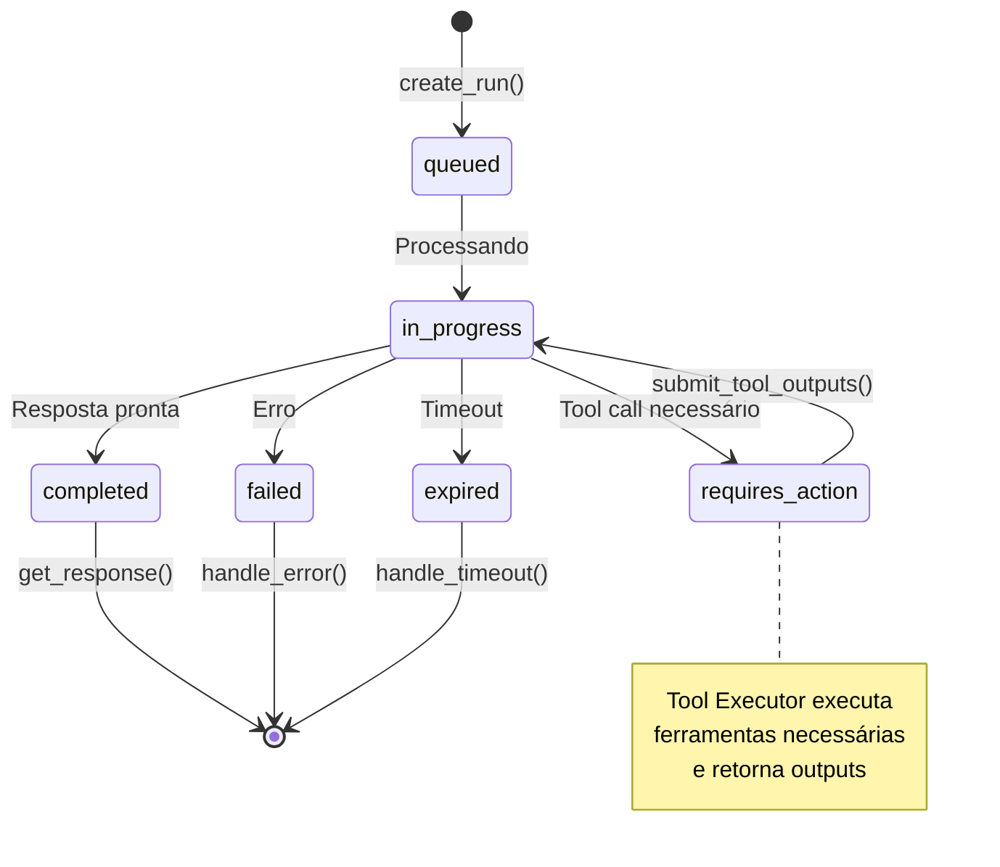

**Estados do Run:**

- **queued**: Run criado, aguardando processamento
- **in_progress**: OpenAI processando mensagem
- **requires_action**: Precisa executar tool call
- **completed**: Processamento concluído
- **failed**: Erro no processamento
- **expired**: Timeout (> 10 minutos)

---

## 🚀 Pipeline de Deploy

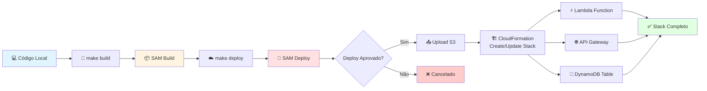

---

## 🧪 Ambiente de Desenvolvimento Local

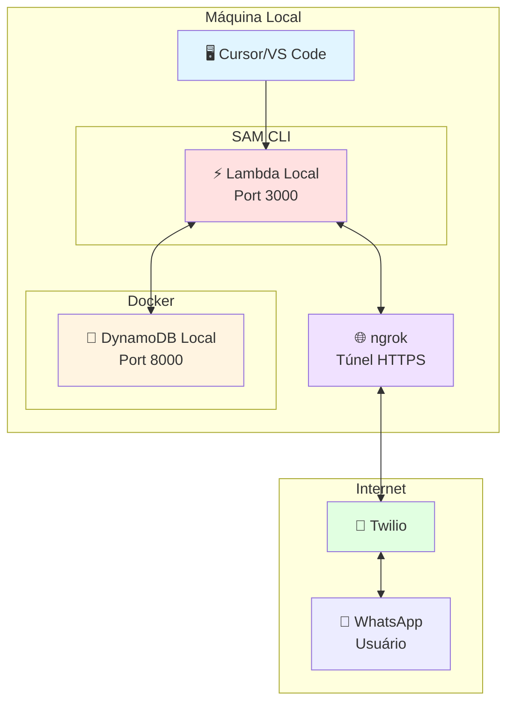

**Comandos:**
```bash
# Terminal 1
make start-dynamodb-local

# Terminal 2
make start-api

# Terminal 3
make start-ngrok
```

---

## 📈 Monitoramento e Observabilidade

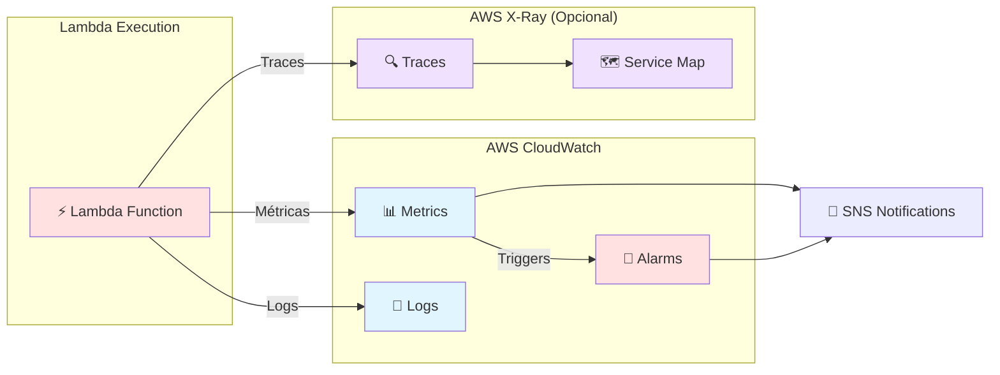

**Métricas Importantes:**
- Invocations (total de execuções)
- Errors (erros)
- Duration (tempo de execução)
- Throttles (limitações)
- Concurrent Executions (execuções simultâneas)

---

## 🔄 Estratégia de Retry e Error Handling

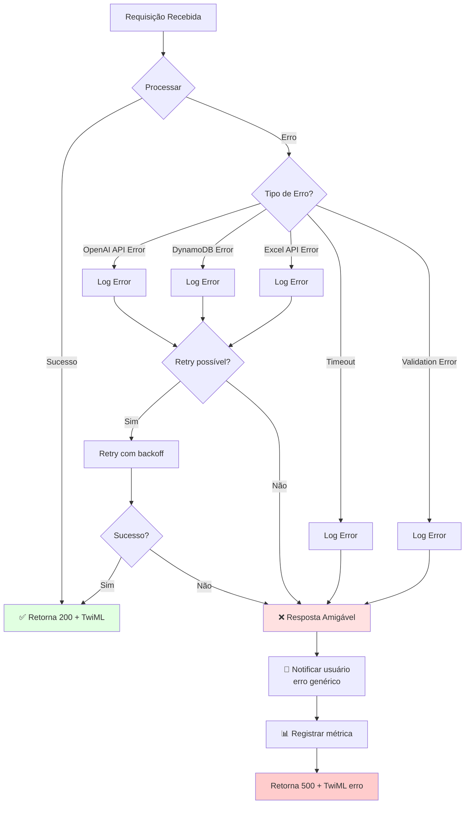

---

## 📚 Dependências do Projeto

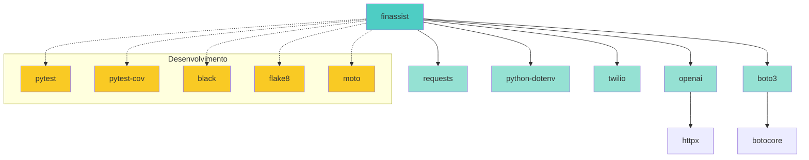

---

## 🎯 Decisões de Design - Trade-offs

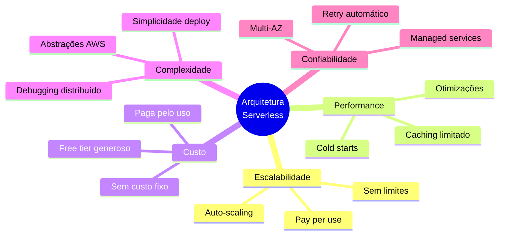

---

**Documento criado em**: 21/10/2025
**Última atualização**: 22/10/2025
**Versão**: 1.1 - Adicionado suporte a áudio/Whisper API

> 💡 **Dica**: Para visualizar os diagramas Mermaid, use:
> - GitHub (suporte nativo)
> - VS Code/Cursor com extensão Mermaid Preview
> - [Mermaid Live Editor](https://mermaid.live)


